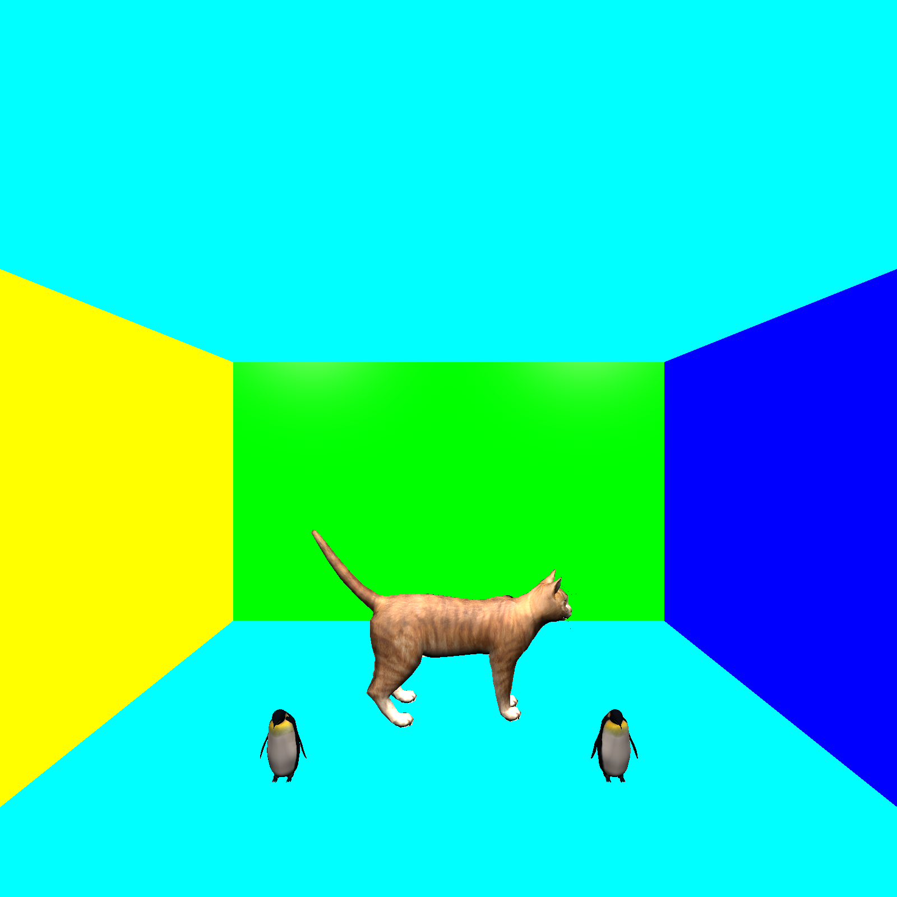
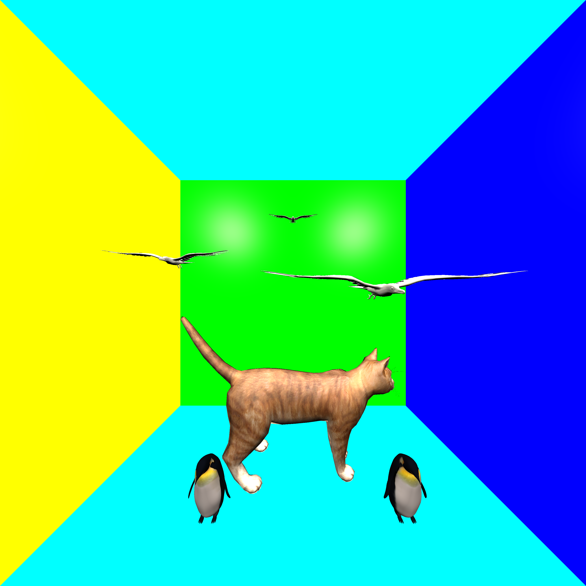

# Demo
The result is a 3200x3200 (for optimal viewing pleasure) image.
It consists of a perfect mirror box. Inside this box multiple textured models are loaded.

At the bottom of this readme you can find what we have done exactly.

## Result

## Room without mirroring

## Runtime
Executing the large scene (`scene08_big.json`) takes 50-60 mins on a Ryzen 7 1700 @ 3.3GHz

You can also try the smaller demo with the name `scene08_big_1600.json`.

# Changes for the competition?
We have extended the raytracer code from the assignments with the following items:
- Interpolating normals for a mesh
- Texture support for a mesh
- (Optional) bilinear filtering for textures
- k-d tree for objects (only Sphere/MeshTriangle supported)
- OpenMP
- Added perfect mirrors

## Texture & normal interpolation
We load the texture coordinates and normals from each model `Vertex` in the `MeshTriangle` class.

The interpolation for both the coordinates and normals happen using barycentric coordinates.

The point of impact from the ray gets converted to barycentric coordinates and then these are used to get a weighted average of the normals and texture coordinates.

## Bilinear filtering
The `Image` class has been modified to be able to use bilinear texture filtering.

You can enable/disable this feature by defining `RT_USE_BILINEAR_TEXTURE_FILTERING` (In cmake file `-DRT_USE_BILINEAR_TEXTURE_FILTERING`)

 

(left: no bilinear filtering, right: bilinear filtering enabled)