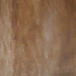
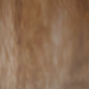

# Raytracer - Demo

We have extended the raytracer code from the assignments with the following items:
- Interpolating normals for a mesh
- Texture support for a mesh
- (Optional) bilinear filtering for textures
- k-d tree for objects (only Sphere/MeshTriangle supported)
- OpenMP

# Texture & normal interpolation
We load the texture coordinates and normals from each model `Vertex` in the `MeshTriangle` class.

The interpolation for both the coordinates and normals happen using barycentric coordinates.

The point of impact from the ray gets converted to barycentric coordinates and then these are used to get a weighted average of the normals and texture coordinates.

# Bilinear filtering
The `Image` class has been modified to be able to use bilinear texture filtering.

You can enable/disable this feature by defining `RT_USE_BILINEAR_TEXTURE_FILTERING`

 

(left: no bilinear filtering, right: bilinear filtering enabled)